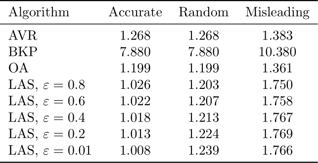

# Contents
The current folder contains the following files:
- ``loc-brightkite_totalCheckins.txt``: Brightkite time and location information of check-ins (<https://snap.stanford.edu/data/loc-Brightkite.html>). Each line contains **[user] [chek-in-time] [latitude] [longitude] [location id]**
- ``scheduling_algorithms.py``: Implementation of offline, online and learning augmented algorithms for the problem of energy minimization via speed scaling.
- ``scheduling_functions.py``: A collection of functions used as subroutines by the scheduling algorithms in ``scheduling_algorithms.py``
- ``Fast_Introduction.ipynb`` A jupyter notebook which presents a fast introduction on how to create and run experiments.
- ``Artificial_Data_alltogether.ipynb``: A jupyter notebook  which reproduces the results of the Artificial datasets in section 4 of the paper.
- ``Real_Data_alltogether.ipynb``: A jupyter notebook  which reproduces the results of the Real dataset in section 4 of the paper (the data preprocessing is described in the beginning of this notebook).


# Prerequisites

#### Dependencies

- Conda version 4.7.11
- Python version  3.7.4

#### Install Requirements
To create a conda environment for the project please run the following commands:

```
conda create -n LAS python==3.7.4
conda activate LAS
```

In order to install the rest of the requirements, please run:

```
pip install -r requirements.txt
```

# Results
Running all cells of the``Artificial_Data_alltogether.ipynb`` notebook reproduces the results of Table 1 in the paper.



Running all cells of the ``Real_Data_alltogether.ipynb`` notebook (it may take a while) stores the results in the file ``Real_Dataset_Results.db`` and (re)creates Figure 2 in the paper as ``final_real_plot.svg``.


